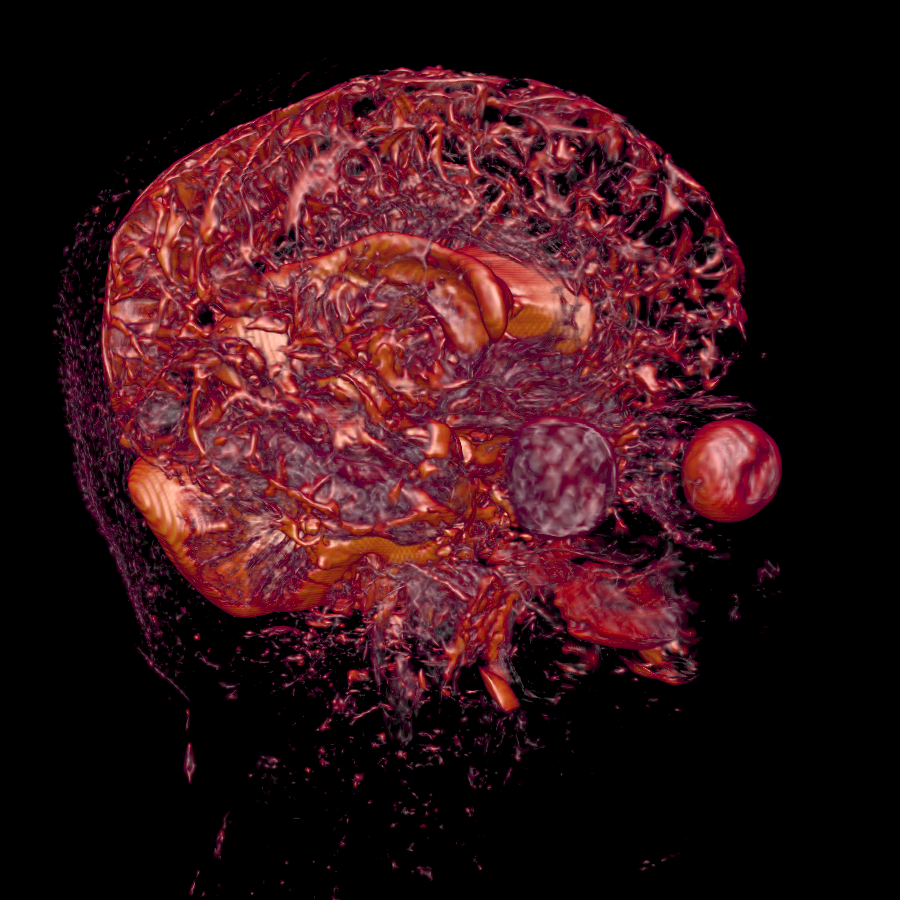
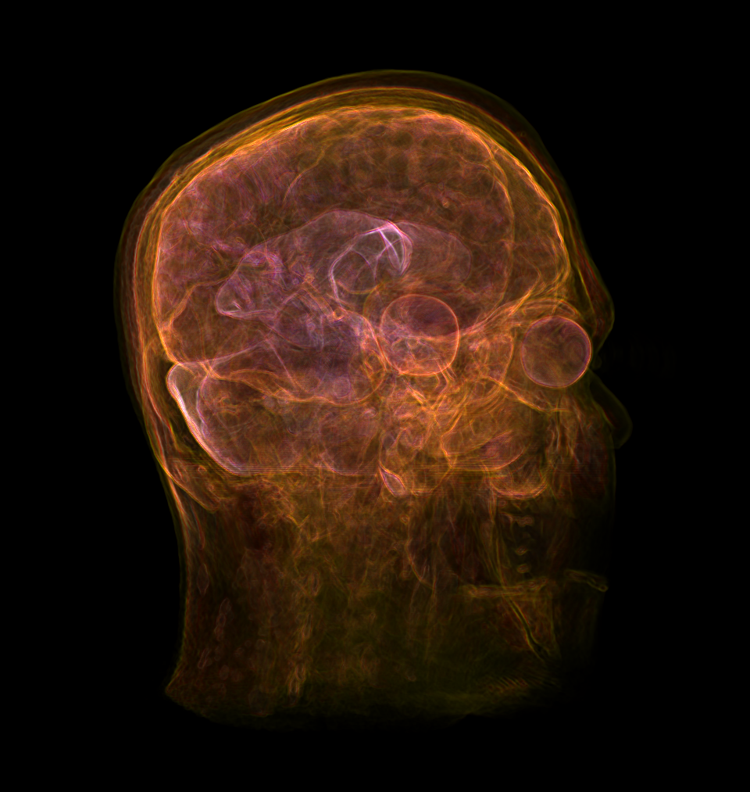
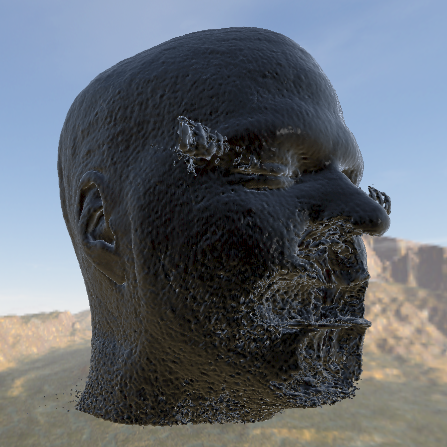
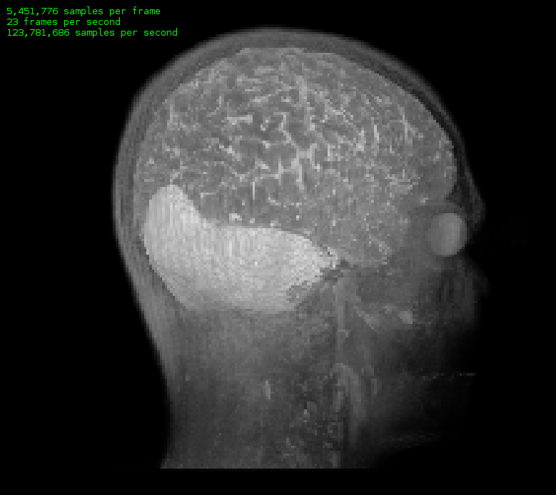

# Volume Rendering for the Browser

[See it in action!](https://draemm.li/various/volumeRendering/webgl2/)

This project aims to develop a powerful real-time volume rendering engine for the browser.



This is accomplished using [volume ray casting](https://en.wikipedia.org/wiki/Volume_ray_casting), implemented in WebGL 2.



A variety of shaders exist, from basic maximum-intensity projection to photorealistic graphics.



## How do I render my own data?

I am planning to implement a better way to do this, but for now, you'll have to clone the project and edit the code to add your own images.

First, have a look at [webgl2/images/sagittal.png](webgl2/images/sagittal.png).
Slices from the image data are tiled into one image top-down, then left-right.
Multiple columns are sometimes necessary because browsers have [limits on the maximum size](https://stackoverflow.com/questions/6081483/maximum-size-of-a-canvas-element) of a `<canvas>` element.

To generate such an image, [ImageMagick](https://www.imagemagick.org/Usage/montage/) is a powerful tool.

Once you have generated your image, add an entry to the `volumes` variable in [webgl2/js/raycasting.js](webgl2/js/raycasting.js):

```javascript
var volumes = {
    sagittal: {                        // any variable name
         src: "./images/sagittal.png"  // path to your image
        ,name: "Brain - Water"         // a (somewhat) descriptive name
        ,columns: 2                    // number of columns by which your tiles are arranged
        ,slices: 176                   // number of total image slices
        ,zScale: 0.7                   // ratio of distance between slices to distance between pixels
    }
    // ...
}
```

When you refresh the page, you should now see your volume in the drop down list.

## Volume Generator

For testing, there's a [volume generator](https://draemm.li/various/volumeRendering/volumeGenerator/), which might also be interesting for other projects working with volume data.

## CPU-Only version

Before implementing this project in WebGL, I wrote a [volume renderer in pure CPU-side, single-threaded JavaScript](https://draemm.li/various/volumeRendering/cpu/).



With some tweaking, I managed to get it running at 60fps on my old ThinkPad.

## Previous work

This project is the successor of earlier experiments with volume rendering by drawing point clouds:  
[GitHub](https://github.com/RolandR/brainrender), [Web](https://draemm.li/various/brainrender/)

## Disclaimer

This is an experimental project developed by someone who has no real experience or training in medical imaging.  
**It is not intended or suitable for clinical use.**